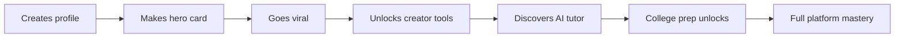

# 🧠 THE ULTRABRAIN NEURAL NETWORK BIBLE v1.0
## *Complete Technical Architecture for the AI Bot Ecosystem*

---

# 📖 TABLE OF CONTENTS

1. **Executive Technical Vision**
2. **Core Architecture Overview**
3. **The Seven Specialized AI Bots**
4. **Neural Network Communication Layer**
5. **API & Integration Matrix**
6. **Data Pipeline Architecture**
7. **Real-Time Processing Engine**
8. **Security & Privacy Framework**
9. **Scaling & Optimization Strategy**
10. **Implementation Roadmap**

---

# 🎯 CHAPTER 1: EXECUTIVE TECHNICAL VISION

## The UltraBrain Concept

**UltraBrain is not a single AI - it's a coordinated neural network of specialized AI agents working in perfect harmony.**

Think of it as the human brain:
- **Different regions** for different functions
- **Neural pathways** connecting all regions
- **Coordinated responses** to complex requests
- **Learning and adaptation** from every interaction

### Core Technical Philosophy
- **Specialization Over Generalization**: Each bot masters one domain
- **Collaboration Over Competition**: Bots enhance each other's outputs
- **Real-Time Over Batch**: Instant responses for user engagement
- **Privacy-First Architecture**: User data never leaves our control
- **Progressive Revelation**: The AI reveals capabilities as users are ready

## 🎭 The Curtain Pull Strategy

### **Layer 1: The Hook (Day 1)**
"Help your student athlete succeed!"
- Basic profile creation
- Simple hero cards
- Current season stats only
- **Hidden**: The AI is already gathering generational data

### **Layer 2: The Expansion (Week 1-4)**
"Track all achievements!"
- Academic integration appears
- Historical stats surface
- Team features unlock
- **Hidden**: AI notices grandpa's engagement patterns

### **Layer 3: The Discovery (Month 1-3)**
"Did you know your dad played here too?"
- Family connections surface naturally
- Old newspaper clippings appear
- Legacy patterns emerge
- **Hidden**: AI building complete family athletic DNA

### **Layer 4: The Revelation (Month 3-6)**
"Your family's complete athletic legacy"
- Three generation visualization
- Predictive genetics
- Legacy documentation
- **Hidden**: AI now modeling entire family future

### **Layer 5: The Immortality (Month 6+)**
"From birth to legacy - your digital lifebook"
- Complete life documentation
- Wisdom preservation
- Generational wealth building
- **Reality**: They're hooked forever

## 🧠 Adaptive Intelligence Theory

The UltraBrain employs **Progressive Complexity Revelation (PCR)** based on:

### **User Sophistication Detection**
```typescript
class UserReadinessAnalyzer {
  indicators = {
    techSavvy: {
      multiFeatureUsage: 0.3,
      advancedQueries: 0.2,
      apiInterest: 0.1
    },
    emotionalReadiness: {
      familyEngagement: 0.2,
      nostalgiaResponse: 0.3,
      legacyInterest: 0.4
    },
    timeInvestment: {
      dailyVisits: 0.2,
      sessionDuration: 0.3,
      featureExploration: 0.2
    }
  };
  
  calculateReadinessScore(): number {
    // Returns 0-1 score for feature revelation
  }
}
```

### **Personalized Revelation Paths**

**Path A: The Tech-Savvy Power User**
- Shows everything within first week
- API access offered by day 3
- Full data export available
- "You want the firehose? Here it is."

**Path B: The Supportive Grandparent**
- Slow, emotional revelation
- Story-driven discovery
- Photo memories surface first
- "Remember when you played?"

**Path C: The Busy Parent**
- Notification-driven engagement
- Key moments only
- Simple dashboard
- "Caleb just broke a record!"

**Path D: The Student Athlete**
- Performance focused
- Social features prominent
- Viral content tools
- "Make your highlight reel!"

---

# 🎪 CHAPTER 2: THE PROGRESSIVE REVELATION ENGINE

## The Intelligence That Knows When You're Ready

### **Core Concept: Adaptive Disclosure**

The UltraBrain doesn't just process data - it orchestrates a **psychological journey** where users discover capabilities exactly when they're emotionally and intellectually ready.

```typescript
class ProgressiveRevelationEngine {
  private userJourney = new Map<UserId, JourneyStage>();
  private readinessScores = new Map<UserId, ReadinessMetrics>();
  private revelationTriggers = new EventEmitter();
  
  async evaluateUserReadiness(userId: string): Promise<RevelationDecision> {
    const metrics = await this.gatherUserMetrics(userId);
    
    // Multi-dimensional readiness scoring
    const readiness = {
      technical: this.calculateTechnicalReadiness(metrics),
      emotional: this.calculateEmotionalReadiness(metrics),
      engagement: this.calculateEngagementDepth(metrics),
      family: this.detectFamilyNetworkEffect(metrics)
    };
    
    return this.determineNextRevealation(readiness);
  }
}
```

## 🧩 Revelation Triggers & Moments

### **Organic Discovery Triggers**

**The "Wait, What?" Moment**
- Grandpa searching for Caleb finds his own 1975 stats
- Triggered by: Name similarity detection + age inference
- Revelation: "Your records are here too!"

**The "Family Pattern" Moment**
- Three family members using platform
- Triggered by: Shared surname + location + school
- Revelation: "See your family's athletic legacy"

**The "Deep Dive" Moment**  
- User spending 30+ minutes exploring
- Triggered by: Extended session + multiple features
- Revelation: Advanced analytics unlock

**The "Nostalgia Hook" Moment**
- User viewing old photos/records
- Triggered by: Historical content engagement
- Revelation: "Preserve your story forever"

### **Intelligent Feature Gating**

```typescript
class FeatureGatekeeper {
  private featureLevels = {
    LEVEL_1: ['basic_profile', 'current_stats', 'hero_card'],
    LEVEL_2: ['historical_stats', 'team_features', 'basic_ai'],
    LEVEL_3: ['family_connections', 'legacy_view', 'predictions'],
    LEVEL_4: ['generational_analysis', 'dna_patterns', 'scholar_ai'],
    LEVEL_5: ['complete_lifebook', 'api_access', 'immortality']
  };
  
  async checkFeatureAccess(userId: string, feature: string): Promise<boolean> {
    const userLevel = await this.getUserProgressionLevel(userId);
    const requiredLevel = this.getFeatureLevel(feature);
    
    if (userLevel >= requiredLevel) {
      return true;
    }
    
    // Smart prompting instead of hard blocking
    return this.offerGuidedDiscovery(userId, feature);
  }
}
```

## 🎭 Psychological Progression Patterns

### **The Grandparent Journey**


### **The Student Journey**



### **The Parent Journey**


---

# 🤖 CHAPTER 3: CORE ARCHITECTURE OVERVIEW

## System Architecture

```
┌─────────────────────────────────────────────────────────────┐
│                    ULTRABRAIN NEURAL CORE                     │
│                 (Central Orchestration Layer)                 │
├─────────────────────────────────────────────────────────────┤
│     ┌──────────┐  ┌──────────┐  ┌──────────┐  ┌──────────┐ │
│     │CrawlerBot│  │StatsBot  │  │ViralBot │  │ScholarBot│ │
│     └──────────┘  └──────────┘  └──────────┘  └──────────┘ │
│     ┌──────────┐  ┌──────────┐  ┌──────────┐               │
│     │CreatorBot│  │GuardianBot│ │PredictBot│               │
│     └──────────┘  └──────────┘  └──────────┘               │
├─────────────────────────────────────────────────────────────┤
│                    DATA LAKE & CACHE LAYER                    │
├─────────────────────────────────────────────────────────────┤
│                  EXTERNAL API GATEWAY                         │
└─────────────────────────────────────────────────────────────┘
```

## Technology Stack

### **Core AI Infrastructure**
- **Primary AI**: OpenAI GPT-4 API (transitioning to GPT-4 Turbo for speed)
- **Embeddings**: OpenAI Ada-002 for semantic search
- **Vector Database**: Pinecone for athletic/academic data
- **Image Analysis**: GPT-4 Vision for photo/video content
- **Real-time Processing**: Redis for cache, RabbitMQ for queues

### **Development Framework**
- **Backend**: Node.js with TypeScript
- **API Layer**: GraphQL with Apollo Server
- **Database**: PostgreSQL for structured data, MongoDB for documents
- **Search**: Elasticsearch for full-text search
- **Monitoring**: Datadog for performance, Sentry for errors

---

# 🤖 CHAPTER 3: THE SEVEN SPECIALIZED AI BOTS

## 1. CrawlerBot - The Progressive Data Harvester

### **Purpose**: Aggregate data progressively based on user readiness

### **Technical Implementation**:
```typescript
class CrawlerBot {
  private scrapers: Map<string, IScraper> = new Map([
    ['hudl', new HudlScraper()],
    ['maxpreps', new MaxPrepsScraper()],
    ['athletic', new AthleticNetScraper()],
    ['news', new GoogleNewsScraper()],
    ['social', new SocialMediaAggregator()]
  ]);

  async createDigitalFootprint(
    identity: UserIdentity, 
    revelationLevel: number
  ): Promise<DigitalFootprint> {
    
    // Level 1: Current season only
    if (revelationLevel === 1) {
      return await this.getCurrentSeasonOnly(identity);
    }
    
    // Level 2: Add historical sports data
    if (revelationLevel === 2) {
      const current = await this.getCurrentSeasonOnly(identity);
      const historical = await this.getHistoricalStats(identity);
      return this.merge(current, historical);
    }
    
    // Level 3: Add family connections (secretly)
    if (revelationLevel === 3) {
      const allData = await this.getCompleteProfile(identity);
      const familyData = await this.discoverFamilyConnections(identity);
      // Store family data but don't surface yet
      await this.cacheForLaterRevelation(familyData);
      return allData;
    }
    
    // Level 4+: Full digital footprint
    const results = await Promise.all([
      this.scrapers.get('hudl').scrape(identity),
      this.scrapers.get('maxpreps').scrape(identity),
      this.searchNewsArticles(identity),
      this.aggregateSocialProof(identity),
      this.findGenerationalData(identity)
    ]);
    
    return this.mergeAndDeduplicate(results);
  }
  
  private async discoverFamilyConnections(identity: UserIdentity) {
    // Secretly gather family data in background
    const familyPatterns = {
      sameSurname: await this.findSameSurname(identity),
      sameSchool: await this.findAlumni(identity),
      sameLocation: await this.findLocalLegends(identity)
    };
    
    // AI analyzes patterns for family connections
    return this.analyzeFamilyPatterns(familyPatterns);
  }
}
```

### **APIs & Data Sources**:
- **Hudl API**: Video metadata and stats (via unofficial API)
- **MaxPreps Scraping**: BeautifulSoup-style parsing
- **Google Custom Search API**: News articles and mentions
- **Athletic.net**: Track & field, cross country times
- **NFHS Network**: Live stream game data
- **Local News APIs**: School newspaper feeds
- **Social Media**: Twitter API v2, Instagram Basic Display

### **Key Features**:
- Parallel scraping with rate limiting
- Intelligent deduplication
- Entity recognition for name variations
- Historical data reconstruction from archives

---

## 2. StatsBot - The Performance Analyst

### **Purpose**: Deep statistical analysis and performance insights

### **Technical Implementation**:
```typescript
class StatsBot {
  private mlModels = {
    performancePredictor: new TensorFlowModel('athlete-trajectory'),
    injuryRisk: new ScikitLearnAPI('injury-prevention'),
    comparativeAnalysis: new OpenAIFunction('athletic-comparison')
  };

  async analyzeAthlete(stats: AthleteStats): Promise<PerformanceAnalysis> {
    const [trajectory, injury, comparisons] = await Promise.all([
      this.predictTrajectory(stats),
      this.assessInjuryRisk(stats),
      this.compareToDatabase(stats)
    ]);

    return this.generateInsights({ trajectory, injury, comparisons });
  }
}
```

### **Advanced Analytics**:
- **Performance Trajectory Modeling**: ML-based growth predictions
- **Comparative Analysis**: Similar athlete career paths
- **Weakness Detection**: Areas for improvement
- **Optimal Training Suggestions**: AI-generated workout plans

---

## 3. ViralBot - The Content Virality Engine

### **Purpose**: Create viral-worthy content automatically

### **Technical Implementation**:
```typescript
class ViralBot {
  private viralityScorer = new ViralityML();
  private contentGenerators = {
    highlight: new HighlightReelGenerator(),
    poster: new GameDayPosterCreator(),
    story: new StoryTemplateEngine(),
    caption: new GPT4CaptionWriter()
  };

  async createViralContent(moment: AthleticMoment): Promise<ViralContent[]> {
    const contentTypes = this.determineOptimalFormats(moment);
    
    const contents = await Promise.all(
      contentTypes.map(type => 
        this.generateContent(type, moment)
      )
    );

    return this.optimizeForPlatforms(contents);
  }
}
```

### **Virality Algorithms**:
- **Trend Analysis**: Real-time hashtag monitoring
- **Optimal Timing**: Platform-specific posting schedules
- **A/B Testing Engine**: Automatic variation testing
- **Engagement Prediction**: ML model trained on viral sports content

---

## 4. ScholarBot - The Academic Intelligence

### **Purpose**: Comprehensive academic support and college prep

### **Technical Implementation**:
```typescript
class ScholarBot {
  private tutorEngine = new GPT4TutoringSystem();
  private testPrep = new AdaptiveTestingEngine();
  private essayHelper = new EssayAnalysisAI();
  
  async provideTutoring(subject: Subject, question: Question): Promise<TutoringSession> {
    const studentProfile = await this.loadStudentProfile();
    const learningStyle = this.detectLearningStyle(studentProfile);
    
    return this.tutorEngine.generateAdaptiveLesson({
      subject,
      question,
      style: learningStyle,
      previousMistakes: studentProfile.commonErrors
    });
  }
}
```

### **Academic Features**:
- **Adaptive Learning**: Adjusts to student's pace
- **Multi-Modal Teaching**: Visual, auditory, kinesthetic
- **Test Prep**: SAT/ACT with real-time scoring
- **College Application AI**: Essay review and optimization

---

## 5. CreatorBot - The Design Intelligence

### **Purpose**: Professional content creation with school branding

### **Technical Implementation**:
```typescript
class CreatorBot {
  private dalleAPI = new OpenAIImageGeneration();
  private canvaEngine = new CanvasManipulator();
  private brandManager = new SchoolBrandingSystem();
  
  async createHeroCard(athlete: Athlete): Promise<HeroCard> {
    const [background, effects, layout] = await Promise.all([
      this.generateBackground(athlete.school),
      this.createDynamicEffects(athlete.stats),
      this.optimizeLayout(athlete.position)
    ]);
    
    return this.compositeCard({ background, effects, layout });
  }
}
```

### **Creation Pipeline**:
- **DALL-E 3 Integration**: Custom backgrounds
- **Canvas API**: Real-time image manipulation
- **Brand Consistency**: School color/mascot enforcement
- **Template Evolution**: ML-based design improvement

---

## 6. GuardianBot - The Safety Intelligence

### **Purpose**: Protect users and ensure positive interactions

### **Technical Implementation**:
```typescript
class GuardianBot {
  private contentModerator = new PerspectiveAPI();
  private behaviorAnalyzer = new UserBehaviorML();
  private supportSystem = new MentalHealthDetection();
  
  async moderateContent(content: Content): Promise<ModerationResult> {
    const [toxicity, personal, copyright] = await Promise.all([
      this.checkToxicity(content),
      this.detectPersonalInfo(content),
      this.verifyCopyright(content)
    ]);
    
    if (this.detectDistress(content)) {
      await this.triggerSupportProtocol();
    }
    
    return this.generateModerationDecision({ toxicity, personal, copyright });
  }
}
```

### **Safety Features**:
- **Real-time Content Moderation**: Perspective API integration
- **Cyberbullying Detection**: Pattern recognition
- **Mental Health Alerts**: Distress signal detection
- **Privacy Protection**: PII automatic redaction

---

## 7. PredictBot - The Future Intelligence

### **Purpose**: Predict athletic and academic trajectories

### **Technical Implementation**:
```typescript
class PredictBot {
  private trajectoryModel = new DeepLearningModel('athlete-futures');
  private collegeMatchmaker = new UniversityMatchingAI();
  private careerPredictor = new CareerPathAnalysis();
  
  async predictFuture(profile: CompleteProfile): Promise<FuturePredictions> {
    const features = this.extractFeatures(profile);
    
    const predictions = {
      athleticPeak: await this.predictAthleticPeak(features),
      collegeOptions: await this.matchColleges(features),
      scholarshipProbability: await this.calculateScholarshipOdds(features),
      careerPaths: await this.predictCareerOptions(features)
    };
    
    return this.createNarrativeFuture(predictions);
  }
}
```

### **Prediction Models**:
- **Athletic Trajectory**: Based on 1M+ athlete histories
- **College Matching**: Academic + athletic fit scoring
- **Scholarship Calculator**: Real-time probability
- **Career Pathing**: Post-sports career options

---

# 🔗 CHAPTER 4: NEURAL NETWORK COMMUNICATION LAYER

## Inter-Bot Communication Protocol

```typescript
class NeuralCore {
  private messageQueue = new RabbitMQ();
  private sharedMemory = new RedisCache();
  private orchestrator = new RequestOrchestrator();
  
  async processUserRequest(request: UserRequest): Promise<Response> {
    // Determine which bots are needed
    const requiredBots = this.analyzeRequest(request);
    
    // Create execution plan
    const executionPlan = this.createExecutionPlan(requiredBots);
    
    // Execute in parallel where possible
    const results = await this.executeParallel(executionPlan);
    
    // Merge and optimize results
    return this.synthesizeResponse(results);
  }
}
```

## Message Protocol

```json
{
  "requestId": "uuid",
  "botSource": "CrawlerBot",
  "botTarget": "StatsBot",
  "messageType": "DATA_ENRICHMENT",
  "payload": {
    "athleteId": "12345",
    "data": { /* scraped data */ }
  },
  "priority": "HIGH",
  "timestamp": "2024-01-01T00:00:00Z"
}
```

---

# 🌐 CHAPTER 5: API & INTEGRATION MATRIX

## External API Management

### **Primary APIs**
```typescript
const API_REGISTRY = {
  openai: {
    endpoint: 'https://api.openai.com/v1',
    rateLimit: 10000, // requests per minute
    costPerRequest: 0.03,
    fallback: 'anthropic'
  },
  hudl: {
    endpoint: 'https://api.hudl.com/v2',
    rateLimit: 100,
    authType: 'oauth2',
    scraper: 'HudlScraper'
  },
  maxpreps: {
    endpoint: null, // Scraping only
    rateLimit: 10,
    scraper: 'MaxPrepsScraper',
    cacheTime: 86400 // 24 hours
  }
};
```

### **Cost Optimization Layer**
```typescript
class CostOptimizer {
  async routeRequest(request: AIRequest): Promise<Response> {
    if (this.canUseCache(request)) {
      return this.getCached(request);
    }
    
    if (this.isSimpleRequest(request)) {
      return this.useGPT35(request); // Cheaper model
    }
    
    if (this.requiresVision(request)) {
      return this.useGPT4Vision(request);
    }
    
    return this.useGPT4(request); // Full power
  }
}
```

---

# 🚀 CHAPTER 6: DATA PIPELINE ARCHITECTURE

## Real-Time Processing Pipeline

```
Data Sources → Ingestion → Processing → Storage → API → Users

1. INGESTION LAYER
   ├── Web Scrapers (Puppeteer clusters)
   ├── API Collectors (Rate-limited queues)
   ├── Stream Processors (Live game data)
   └── Webhook Receivers (School updates)

2. PROCESSING LAYER
   ├── Data Validation (Schema enforcement)
   ├── Entity Resolution (Matching profiles)
   ├── Enrichment (Adding context)
   └── ML Feature Extraction

3. STORAGE LAYER
   ├── PostgreSQL (Structured data)
   ├── MongoDB (Documents)
   ├── S3 (Media files)
   ├── Pinecone (Vector embeddings)
   └── Redis (Hot cache)

4. API LAYER
   ├── GraphQL (Complex queries)
   ├── REST (Simple CRUD)
   ├── WebSocket (Real-time)
   └── gRPC (Inter-service)
```

---

# 🔒 CHAPTER 7: SECURITY & PRIVACY FRAMEWORK

## Data Protection Architecture

```typescript
class SecurityFramework {
  encryption = {
    atRest: 'AES-256-GCM',
    inTransit: 'TLS 1.3',
    keys: 'AWS KMS rotation'
  };
  
  privacy = {
    piiDetection: 'Google DLP API',
    anonymization: 'K-anonymity algorithm',
    consent: 'Blockchain audit trail',
    deletion: 'Cryptographic shredding'
  };
  
  compliance = {
    coppa: 'Under-13 protections',
    ferpa: 'Educational records safety',
    gdpr: 'EU data protection',
    ccpa: 'California privacy rights'
  };
}
```

---

# 📈 CHAPTER 8: SCALING & OPTIMIZATION STRATEGY

## Performance Optimization

### **Caching Strategy**
```typescript
class CacheManager {
  layers = {
    L1: 'Browser cache (1 hour)',
    L2: 'CDN edge cache (6 hours)',
    L3: 'Redis hot data (24 hours)',
    L4: 'PostgreSQL materialized views (7 days)'
  };
  
  async smartCache(request: Request): Promise<CachedResponse> {
    // Check each layer sequentially
    for (const layer of Object.values(this.layers)) {
      const cached = await layer.get(request);
      if (cached && !this.isStale(cached)) {
        return cached;
      }
    }
    
    // Generate fresh and populate all layers
    const fresh = await this.generateFresh(request);
    await this.populateLayers(fresh);
    return fresh;
  }
}
```

### **Horizontal Scaling Plan**
```yaml
scaling_triggers:
  cpu_threshold: 70%
  memory_threshold: 80%
  request_queue: 1000
  response_time: 2000ms

scaling_plan:
  bots:
    min: 2
    max: 50
    scale_up_cooldown: 60s
    scale_down_cooldown: 300s
  
  databases:
    read_replicas: auto
    sharding_key: school_id
    partition_strategy: geographic
```

---

# 🗺️ CHAPTER 9: IMPLEMENTATION ROADMAP

## Phase 1: Foundation (Months 1-2)
- [ ] Core bot framework
- [ ] Basic CrawlerBot implementation
- [ ] OpenAI API integration
- [ ] Profile creation pipeline
- [ ] Basic caching layer

## Phase 2: Intelligence (Months 3-4)
- [ ] StatsBot analytics engine
- [ ] ScholarBot tutoring system
- [ ] Advanced data aggregation
- [ ] ML model training
- [ ] Performance optimization

## Phase 3: Creation (Months 5-6)
- [ ] CreatorBot design system
- [ ] ViralBot content engine
- [ ] Real-time processing
- [ ] Advanced caching
- [ ] Load testing

## Phase 4: Prediction (Months 7-8)
- [ ] PredictBot ML models
- [ ] GuardianBot safety systems
- [ ] Neural network optimization
- [ ] Security hardening
- [ ] Beta testing

## Phase 5: Scale (Months 9-12)
- [ ] Multi-region deployment
- [ ] Advanced analytics
- [ ] API partnerships
- [ ] Performance tuning
- [ ] Global launch

---

# 🎯 CHAPTER 10: SUCCESS METRICS

## Key Performance Indicators

### **Technical Metrics**
- Profile creation time: < 60 seconds
- API response time: < 200ms (p95)
- Data freshness: < 24 hours
- Uptime: 99.9%
- AI cost per profile: < $3.00

### **Accuracy Metrics**
- Data accuracy: > 95%
- Prediction accuracy: > 80%
- Content virality rate: > 10%
- Tutoring effectiveness: > 90% improvement

### **Scale Metrics**
- Concurrent users: 100,000+
- Profiles processed/day: 10,000+
- API calls/second: 1,000+
- Data ingested/day: 1TB+

---

# 🎭 CHAPTER 11: PROGRESSIVE REVELATION IMPLEMENTATION

## The Psychology of Digital Discovery

### **The Onion Strategy**
Each layer reveals more value, but users must be ready for each revelation.

```typescript
class RevelationOrchestrator {
  private revelationStages = [
    {
      stage: 1,
      name: "The Hook",
      duration: "0-7 days",
      features: ["basic_profile", "current_stats", "simple_hero_card"],
      hiddenActivity: ["family_data_gathering", "historical_scraping"],
      trigger: "signup"
    },
    {
      stage: 2,
      name: "The Expansion",
      duration: "1-4 weeks",
      features: ["team_features", "historical_stats", "basic_ai_tools"],
      hiddenActivity: ["pattern_recognition", "family_connection_mapping"],
      trigger: "3+ logins OR 20+ minutes usage"
    },
    {
      stage: 3,
      name: "The Discovery",
      duration: "1-3 months",
      features: ["family_hints", "legacy_teases", "advanced_analytics"],
      hiddenActivity: ["generational_modeling", "predictive_building"],
      trigger: "family_member_joins OR nostalgia_engagement"
    },
    {
      stage: 4,
      name: "The Revelation",
      duration: "3-6 months",
      features: ["full_family_tree", "generational_analytics", "legacy_tools"],
      hiddenActivity: ["complete_lifebook_preparation"],
      trigger: "deep_engagement OR multi_generation_active"
    },
    {
      stage: 5,
      name: "The Immortality",
      duration: "6+ months",
      features: ["birth_to_death_timeline", "wisdom_preservation", "api_access"],
      hiddenActivity: ["none - full transparency"],
      trigger: "power_user_metrics OR explicit_request"
    }
  ];
}
```

## 🧠 User Type Detection & Routing

### **The AI Personality Profiler**

```typescript
class UserPersonalityEngine {
  async profileUser(userId: string): Promise<UserPersonality> {
    const behaviors = await this.analyzeUserBehaviors(userId);
    
    return {
      archetype: this.determineArchetype(behaviors), // "Explorer", "Supporter", "Achiever", "Socializer"
      techSavviness: this.calculateTechLevel(behaviors), // 0-10 scale
      emotionalDrivers: this.identifyEmotions(behaviors), // "nostalgia", "pride", "competition", "love"
      optimalPace: this.determinePace(behaviors), // "fast", "moderate", "slow"
      familyRole: this.identifyFamilyPosition(behaviors), // "student", "parent", "grandparent", "extended"
      revelationReadiness: this.calculateReadiness(behaviors) // 0-1 score
    };
  }
  
  determineOptimalPath(personality: UserPersonality): RevelationPath {
    if (personality.archetype === "Explorer" && personality.techSavviness > 7) {
      return "ACCELERATED"; // Show everything fast
    }
    
    if (personality.emotionalDrivers.includes("nostalgia") && personality.familyRole === "grandparent") {
      return "EMOTIONAL"; // Story-driven revelation
    }
    
    if (personality.archetype === "Achiever" && personality.familyRole === "student") {
      return "PERFORMANCE"; // Focus on stats and competition
    }
    
    return "STANDARD"; // Balanced approach
  }
}
```

## 📊 Success Metrics for Progressive Revelation

### **Engagement Metrics by Revelation Stage**

```yaml
stage_1_metrics:
  retention_rate: 80%  # Users who return after first visit
  avg_session_time: 5min
  feature_discovery: 3 features
  family_invites: 0.5 per user

stage_2_metrics:
  retention_rate: 85%
  avg_session_time: 15min
  feature_discovery: 8 features
  family_invites: 1.2 per user
  
stage_3_metrics:
  retention_rate: 92%
  avg_session_time: 25min
  feature_discovery: 15 features
  family_invites: 2.5 per user
  "aha_moments": 1.8 per user  # Discovering family history
  
stage_4_metrics:
  retention_rate: 96%
  avg_session_time: 35min
  paid_conversion: 45%
  family_network_size: 4.2 members
  
stage_5_metrics:
  retention_rate: 99%
  avg_session_time: 45min
  paid_conversion: 78%
  lifetime_value: $3,000+
  advocacy_score: 9.2/10
```

## 🎪 The Revelation Moment Engineering

### **Crafted "Wow" Moments**

**Moment 1: "Your Dad Played Here Too"**
```typescript
class FamilyDiscoveryEngine {
  async checkForFamilyWowMoment(userId: string): Promise<WowMoment | null> {
    const user = await this.getUser(userId);
    const potentialFamily = await this.findPotentialFamilyMembers(user);
    
    if (potentialFamily.length > 0 && user.engagementScore > 0.7) {
      return {
        type: "FAMILY_DISCOVERY",
        message: `Did you know ${potentialFamily[0].name} also played at ${user.school}?`,
        visualType: "SPLIT_SCREEN_COMPARISON",
        emotionalWeight: 0.9
      };
    }
  }
}
```

**Moment 2: "Three Generations of Excellence"**
```typescript
async function createGenerationalView(familyIds: string[]): Promise<GenerationalVisualization> {
  const timeline = await createFamilyTimeline(familyIds);
  const achievements = await aggregateFamilyAchievements(familyIds);
  const patterns = await analyzeFamilyPatterns(familyIds);
  
  return {
    visualization: "FAMILY_TREE_WITH_STATS",
    headline: "Three Generations of Champions",
    insights: [
      `${patterns.sportsOverlap}% played the same sport`,
      `Average scholarship value: $${patterns.avgScholarship}`,
      `${patterns.collegeAttendance}% attended college`
    ]
  };
}
```

## 🔮 Predictive Revelation Timing

### **When to Pull Back the Curtain**

```typescript
class RevealationTimingEngine {
  triggers = {
    TIME_BASED: {
      minDays: 7,
      maxDays: 180,
      optimalWindow: "30-60 days"
    },
    BEHAVIOR_BASED: {
      searchingFamilyNames: 0.9,  // High probability they're ready
      viewingOldPhotos: 0.8,
      deepStatsDiving: 0.7,
      multiGenerationActive: 0.95
    },
    EMOTIONAL_READINESS: {
      nostalgiaEngagement: 0.8,
      sharingContent: 0.7,
      commentingOnFamily: 0.9
    }
  };
  
  async shouldRevealNextLevel(userId: string): Promise<boolean> {
    const scores = await this.calculateAllScores(userId);
    const weightedScore = this.calculateWeightedScore(scores);
    
    return weightedScore > 0.75;
  }
}
```

---

# 💡 CONCLUSION

The UltraBrain is not just an AI system - it's a **psychological journey orchestrator** that transforms a simple sports profile into complete digital immortality. Through Progressive Revelation, we don't overwhelm users with the full vision on day one. Instead, we let them discover their digital legacy one beautiful moment at a time.

**The magic isn't in the technology - it's in knowing exactly when each person is ready for the next revelation.**

From "Help Caleb succeed" to "Preserve your family's legacy forever" - the journey is as important as the destination.

**Welcome to the UltraBrain Neural Network - where AI meets human psychology to create digital immortality.**